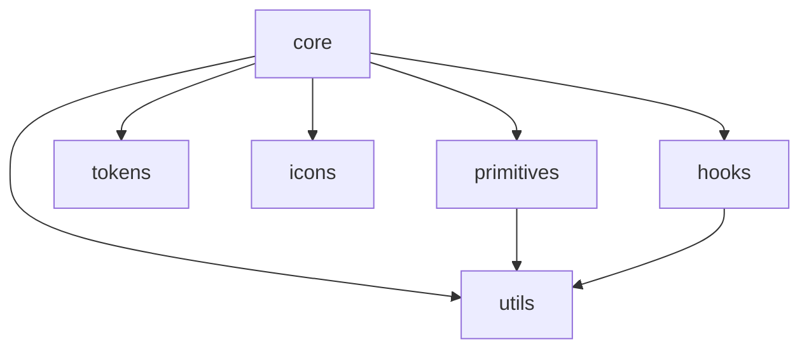

# Design Document - Code Review Engine

## Overview

Este documento detalha as soluções técnicas para os problemas identificados no code review do Pineapple UI. As correções são organizadas por prioridade e incluem exemplos de código, impacto esperado e critérios de validação.

## Architecture

### Estrutura Atual vs Proposta

```
packages/
├── core/           # Componentes estilizados
├── primitives/     # Componentes headless
├── tokens/         # Design tokens (SINGLE SOURCE OF TRUTH)
├── icons/          # Ícones SVG
├── utils/          # Utilitários
└── hooks/          # [NOVO] Hooks reutilizáveis
```

### Diagrama de Dependências



---

## Components and Interfaces

### 1. Correção do Button Loading com asChild

**Problema:** Quando `asChild=true`, o estado de loading é ignorado.

**Solução Proposta:**

```typescript
// packages/core/src/components/button/button.tsx
export const Button = React.forwardRef<HTMLButtonElement, ButtonProps>(
  ({ asChild = false, loading = false, leftIcon, rightIcon, disabled, children, ...props }, ref) => {
    const Comp = asChild ? Slot : 'button';
    
    // Wrapper para conteúdo com loading
    const content = (
      <>
        {loading && <Spinner className="mr-2" />}
        {!loading && leftIcon && <span className="shrink-0">{leftIcon}</span>}
        {children}
        {rightIcon && <span className="shrink-0">{rightIcon}</span>}
      </>
    );

    // Mesmo com asChild, aplicamos loading state
    return (
      <Comp
        ref={ref}
        className={cn(buttonVariants({ variant, size }), className)}
        disabled={disabled || loading}
        aria-busy={loading || undefined}
        {...props}
      >
        {asChild ? (
          <Slottable>{content}</Slottable>
        ) : (
          content
        )}
      </Comp>
    );
  }
);
```

### 2. Reutilização de Ícones

**Problema:** SVGs duplicados em Select e Toast.

**Solução Proposta:**

```typescript
// packages/core/src/components/select/select.tsx
import { ChevronDownIcon, CheckIcon } from '@pineapple-ui/icons';

export const SelectTrigger = React.forwardRef<...>(({ ... }, ref) => (
  <SelectPrimitive.Trigger ref={ref} {...props}>
    {children}
    <SelectPrimitive.Icon asChild>
      <ChevronDownIcon size={16} className="opacity-50" />
    </SelectPrimitive.Icon>
  </SelectPrimitive.Trigger>
));

export const SelectItem = React.forwardRef<...>(({ ... }, ref) => (
  <SelectPrimitive.Item ref={ref} {...props}>
    <span className="absolute left-2 flex h-3.5 w-3.5 items-center justify-center">
      <SelectPrimitive.ItemIndicator>
        <CheckIcon size={16} />
      </SelectPrimitive.ItemIndicator>
    </span>
    <SelectPrimitive.ItemText>{children}</SelectPrimitive.ItemText>
  </SelectPrimitive.Item>
));
```

### 3. FormField Type Safety

**Problema:** Type assertion sem validação.

**Solução Proposta:**

```typescript
// packages/core/src/components/form-field/form-field.tsx
import { InvalidPropError } from '@pineapple-ui/utils';

interface FormFieldChildProps {
  id: string;
  'aria-describedby'?: string;
  'aria-invalid'?: boolean;
  required?: boolean;
  error?: boolean;
}

export function FormField({ children, ...props }: FormFieldProps) {
  // Validação do children
  if (!React.isValidElement(children)) {
    throw new InvalidPropError('FormField', 'children', 'valid React element', children);
  }

  const childWithProps = React.cloneElement(
    children as React.ReactElement<FormFieldChildProps>,
    {
      id,
      'aria-describedby': describedBy,
      'aria-invalid': error ? true : undefined,
      required,
      error: !!error,
    }
  );
  
  return (/* ... */);
}
```

### 4. Extração de Estilos

**Padrão Proposto para Componentes:**

```
component/
├── index.ts           # Exports públicos
├── component.tsx      # Implementação
├── component.styles.ts # Variantes CVA
└── component.test.tsx # Testes
```

**Exemplo - Alert:**

```typescript
// packages/core/src/components/alert/alert.styles.ts
import { cva, type VariantProps } from 'class-variance-authority';

export const alertVariants = cva(
  'relative w-full rounded-lg border p-4 [&>svg~*]:pl-7 [&>svg]:absolute [&>svg]:left-4 [&>svg]:top-4',
  {
    variants: {
      status: {
        info: 'bg-primary-50 border-primary-200 text-primary-800',
        success: 'bg-success-50 border-success-200 text-success-800',
        warning: 'bg-warning-50 border-warning-200 text-warning-800',
        error: 'bg-danger-50 border-danger-200 text-danger-800',
      },
    },
    defaultVariants: {
      status: 'info',
    },
  }
);

export type AlertVariants = VariantProps<typeof alertVariants>;
```

### 5. Single Source of Truth para Tokens

**Problema:** Tokens duplicados em `theme.ts` e `tailwind-config/theme.js`.

**Solução:**

```typescript
// packages/tokens/src/index.ts
export { defaultTheme } from './theme';
export { darkTheme } from './dark-theme';
export { serializeTheme } from './serializer';
export type * from './types';

// Exportar para uso no Tailwind
export { defaultTheme as tailwindTheme } from './theme';
```

```javascript
// tooling/tailwind-config/theme.js
import { tailwindTheme } from '@pineapple-ui/tokens';

// Converter formato se necessário
export const theme = {
  colors: tailwindTheme.colors,
  spacing: tailwindTheme.spacing,
  // ...
};
```

---

## Data Models

### Interface de Componente Padrão

```typescript
// packages/core/src/types/component.ts
export interface BaseComponentProps {
  /** Additional CSS classes */
  className?: string;
  /** Test ID for testing */
  'data-testid'?: string;
}

export interface PolymorphicComponentProps<T extends React.ElementType> {
  /** Element type to render */
  as?: T;
}
```

### Factory para Subcomponentes

```typescript
// packages/core/src/utils/create-subcomponent.ts
export function createSubcomponent<T extends keyof JSX.IntrinsicElements>(
  displayName: string,
  element: T,
  defaultClassName: string
) {
  const Component = React.forwardRef<
    HTMLElementTagNameMap[T],
    React.HTMLAttributes<HTMLElementTagNameMap[T]>
  >(({ className, ...props }, ref) => {
    const Element = element as React.ElementType;
    return <Element ref={ref} className={cn(defaultClassName, className)} {...props} />;
  });
  
  Component.displayName = displayName;
  return Component;
}

// Uso:
export const CardTitle = createSubcomponent(
  'CardTitle',
  'h3',
  'text-lg font-semibold leading-none tracking-tight'
);
```

---

## Correctness Properties

*A property is a characteristic or behavior that should hold true across all valid executions of a system-essentially, a formal statement about what the system should do. Properties serve as the bridge between human-readable specifications and machine-verifiable correctness guarantees.*


### Property Reflection

Após análise do prework, identifiquei as seguintes propriedades testáveis e eliminei redundâncias:

**Propriedades Consolidadas:**
- Properties 2.1 e 2.2 (forwardRef e displayName) podem ser combinadas em uma única propriedade de "Component Contract"
- Properties 6.1 e 6.2 (ARIA roles) podem ser combinadas em uma propriedade de "Accessibility Compliance"
- Properties 11.1 e 11.2 (error handling) podem ser combinadas em uma propriedade de "Error Handling"
- Properties 12.1 e 12.2 (tokens) podem ser combinadas em uma propriedade de "Token Consistency"

---

### Property 1: Component Contract Compliance
*For any* exported component from `@pineapple-ui/core`, when rendered with a ref, the ref SHALL reference the correct underlying DOM element AND the component SHALL have a defined displayName.
**Validates: Requirements 2.1, 2.2**

### Property 2: Button Loading State Preservation
*For any* Button component with `loading=true`, regardless of the `asChild` prop value, the button SHALL be disabled AND display a loading indicator.
**Validates: Requirements 2.4**

### Property 3: Token Usage Consistency
*For any* component variant class generated by CVA, the class string SHALL NOT contain hardcoded color values (like `bg-white`) but SHALL use design token classes (like `bg-neutral-50`).
**Validates: Requirements 3.2**

### Property 4: FormField Props Injection
*For any* valid React element passed as children to FormField, the cloned element SHALL receive the injected props (id, aria-describedby, aria-invalid, required, error) without runtime errors.
**Validates: Requirements 5.2**

### Property 5: ARIA Compliance
*For any* interactive component (Button, Checkbox, Select, Dialog, etc.), when rendered, the component SHALL include all required ARIA attributes for its role.
**Validates: Requirements 6.1, 6.2**

### Property 6: Toast Role Based on Status
*For any* Toast component with `status="error"`, the component SHALL use `role="alert"`, and for other statuses SHALL use `role="status"`.
**Validates: Requirements 6.2**

### Property 7: Error Class Usage
*For any* error thrown by Pineapple UI components, the error SHALL be an instance of `PineappleUIError` or its subclasses AND SHALL include component context.
**Validates: Requirements 11.1, 11.2**

### Property 8: Token Format Validity
*For any* color token in the theme, the value SHALL be a valid oklch color string, AND for any spacing token, the numeric value SHALL be a multiple of 4.
**Validates: Requirements 12.1**

### Property 9: Token Single Source of Truth
*For any* token defined in `@pineapple-ui/tokens`, the corresponding value in `tailwind-config/theme.js` SHALL be identical.
**Validates: Requirements 12.2**

---

## Error Handling

### Estratégia de Erros

```typescript
// packages/utils/src/errors.ts (atualizado)

export const ERROR_CODES = {
  INVALID_PROP: 'INVALID_PROP',
  MISSING_CONTEXT: 'MISSING_CONTEXT',
  INVALID_CHILDREN: 'INVALID_CHILDREN',
  UNSUPPORTED_FEATURE: 'UNSUPPORTED_FEATURE',
} as const;

export type ErrorCode = typeof ERROR_CODES[keyof typeof ERROR_CODES];

export class PineappleUIError extends Error {
  constructor(
    message: string,
    public readonly code: ErrorCode,
    public readonly component?: string,
    public readonly cause?: Error
  ) {
    const prefix = component ? `[Pineapple UI - ${component}]` : '[Pineapple UI]';
    super(`${prefix} ${message}`);
    this.name = 'PineappleUIError';
    
    // Preserve stack trace
    if (cause?.stack) {
      this.stack = `${this.stack}\nCaused by: ${cause.stack}`;
    }
  }
}
```

### Uso nos Componentes

```typescript
// Exemplo em FormField
import { InvalidPropError, MissingContextError } from '@pineapple-ui/utils';

export function FormField({ children, ...props }: FormFieldProps) {
  if (!React.isValidElement(children)) {
    throw new InvalidPropError(
      'FormField',
      'children',
      'valid React element',
      children
    );
  }
  // ...
}
```

---

## Testing Strategy

### Dual Testing Approach

O projeto utiliza duas abordagens complementares de teste:

1. **Unit Tests (Vitest + Testing Library)**: Verificam comportamentos específicos e edge cases
2. **Property-Based Tests (fast-check)**: Verificam propriedades universais com inputs aleatórios

### Property-Based Testing Framework

- **Biblioteca**: fast-check v3.23.2
- **Configuração**: Mínimo de 100 iterações por propriedade
- **Formato de Anotação**: `**Feature: {feature_name}, Property {number}: {property_text}**`

### Exemplo de Teste de Propriedade

```typescript
// packages/core/src/components/button/button.test.tsx
import fc from 'fast-check';

describe('Button Component', () => {
  /**
   * **Feature: code-review-engine, Property 2: Button Loading State Preservation**
   * **Validates: Requirements 2.4**
   */
  it('should preserve loading state regardless of asChild prop', () => {
    fc.assert(
      fc.property(
        fc.boolean(), // asChild
        fc.boolean(), // loading
        (asChild, loading) => {
          const { container } = render(
            <Button asChild={asChild} loading={loading}>
              {asChild ? <a href="#">Link</a> : 'Button'}
            </Button>
          );
          
          const element = container.firstChild as HTMLElement;
          
          if (loading) {
            // Deve estar desabilitado quando loading
            expect(element).toHaveAttribute('disabled');
            // Deve ter aria-busy
            expect(element).toHaveAttribute('aria-busy', 'true');
            // Deve ter spinner
            expect(container.querySelector('svg.animate-spin')).toBeInTheDocument();
          }
        }
      ),
      { numRuns: 100 }
    );
  });
});
```

### Cobertura de Testes Requerida

| Componente | Unit Tests | Property Tests | Status |
|------------|------------|----------------|--------|
| Button | ✅ | ✅ | Completo |
| Input | ✅ | ⚠️ | Parcial |
| Checkbox | ✅ | ✅ | Completo |
| Alert | ✅ | ❌ | Faltando PBT |
| Card | ❌ | ❌ | Faltando |
| Dialog | ❌ | ❌ | Faltando |
| Toast | ❌ | ❌ | Faltando |
| Select | ✅ | ❌ | Faltando PBT |
| FormField | ✅ | ❌ | Faltando PBT |

---

## Migration Plan

### Fase 1: Correções Críticas (P0)

1. **Button Loading com asChild** - 2h
   - Modificar `button.tsx` para preservar loading state
   - Adicionar testes de propriedade

2. **FormField Type Safety** - 1h
   - Adicionar validação de children
   - Usar classes de erro existentes

3. **Reutilização de Ícones** - 2h
   - Substituir SVGs inline por componentes de ícones
   - Atualizar imports em Select e Toast

4. **Single Source of Truth para Tokens** - 3h
   - Refatorar `tailwind-config/theme.js` para importar de `@pineapple-ui/tokens`
   - Atualizar build pipeline

### Fase 2: Melhorias de Qualidade (P1)

1. **Extração de Estilos** - 4h
   - Criar arquivos `.styles.ts` para Alert, Card, Toast, Flex, Select

2. **Testes Faltantes** - 8h
   - Adicionar testes para componentes sem cobertura

3. **CHANGELOG.md** - 1h
   - Criar arquivo e documentar versão atual

### Fase 3: Melhorias de Arquitetura (P2)

1. **Pacote de Hooks** - 4h
   - Criar `@pineapple-ui/hooks`
   - Extrair hooks reutilizáveis

2. **Gerador de Scaffolding** - 4h
   - Configurar plop/hygen
   - Criar templates para componentes

---

## Risks and Mitigations

| Risco | Probabilidade | Impacto | Mitigação |
|-------|---------------|---------|-----------|
| Breaking changes em Button | Média | Alto | Manter backward compatibility, deprecar comportamento antigo |
| Performance de imports de ícones | Baixa | Médio | Tree-shaking já habilitado |
| Conflitos de merge em tokens | Média | Baixo | Fazer refatoração em branch isolada |
