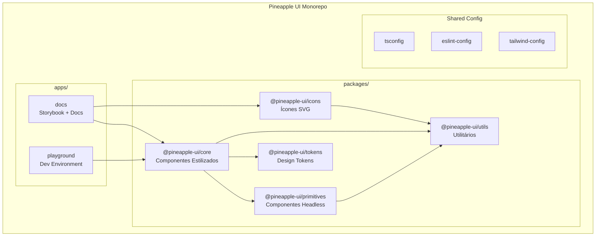

# Design Document - Pineapple UI

## Overview

Pineapple UI é uma biblioteca de componentes React moderna que combina a flexibilidade de componentes headless com a conveniência de componentes pré-estilizados. A arquitetura é baseada em três pilares principais:

1. **Primitivos Acessíveis**: Componentes headless baseados em Radix UI que fornecem comportamento e acessibilidade sem opinião sobre estilos
2. **Sistema de Design Tokens**: Variáveis CSS customizáveis usando Tailwind CSS 4 @theme directive
3. **Componentes Estilizados**: Componentes prontos para uso com variantes type-safe via CVA

A biblioteca é organizada como um monorepo com pacotes independentes que podem ser instalados separadamente, permitindo tree-shaking eficiente e bundles otimizados.

## Architecture



### Estrutura de Diretórios

```
pineapple-ui/
├── apps/
│   ├── docs/                    # Storybook + documentação
│   └── playground/              # Ambiente de desenvolvimento
├── packages/
│   ├── core/                    # Componentes estilizados
│   │   ├── src/
│   │   │   ├── components/
│   │   │   │   ├── button/
│   │   │   │   │   ├── button.tsx
│   │   │   │   │   ├── button.styles.ts
│   │   │   │   │   ├── button.test.tsx
│   │   │   │   │   └── index.ts
│   │   │   │   └── ...
│   │   │   └── index.ts
│   │   ├── package.json
│   │   └── tsconfig.json
│   ├── primitives/              # Componentes headless
│   ├── tokens/                  # Design tokens
│   ├── icons/                   # Ícones SVG
│   └── utils/                   # Utilitários compartilhados
├── tooling/
│   ├── eslint-config/
│   ├── tsconfig/
│   └── tailwind-config/
├── turbo.json
├── pnpm-workspace.yaml
└── package.json
```

## Components and Interfaces

### Design Token System

```typescript
// packages/tokens/src/types.ts
export interface ThemeTokens {
  colors: ColorTokens;
  spacing: SpacingTokens;
  typography: TypographyTokens;
  radii: RadiiTokens;
  shadows: ShadowTokens;
  transitions: TransitionTokens;
}

export interface ColorTokens {
  primary: ColorScale;
  secondary: ColorScale;
  success: ColorScale;
  warning: ColorScale;
  danger: ColorScale;
  neutral: ColorScale;
}

export interface ColorScale {
  50: string;   // oklch format
  100: string;
  200: string;
  300: string;
  400: string;
  500: string;
  600: string;
  700: string;
  800: string;
  900: string;
  950: string;
}

export interface SpacingTokens {
  0: string;    // 0px
  1: string;    // 4px
  2: string;    // 8px
  3: string;    // 12px
  4: string;    // 16px
  5: string;    // 20px
  6: string;    // 24px
  8: string;    // 32px
  10: string;   // 40px
  12: string;   // 48px
  16: string;   // 64px
}

export interface TypographyTokens {
  fontFamily: {
    sans: string;
    mono: string;
  };
  fontSize: {
    xs: string;
    sm: string;
    base: string;
    lg: string;
    xl: string;
    '2xl': string;
    '3xl': string;
  };
  fontWeight: {
    normal: string;
    medium: string;
    semibold: string;
    bold: string;
  };
  lineHeight: {
    tight: string;
    normal: string;
    relaxed: string;
  };
}
```

### Component Variant System (CVA)

```typescript
// packages/core/src/components/button/button.styles.ts
import { cva, type VariantProps } from 'class-variance-authority';

export const buttonVariants = cva(
  // Base styles
  [
    'inline-flex items-center justify-center',
    'font-medium transition-colors',
    'focus-visible:outline-none focus-visible:ring-2',
    'disabled:pointer-events-none disabled:opacity-50',
  ],
  {
    variants: {
      variant: {
        primary: 'bg-primary-500 text-white hover:bg-primary-600',
        secondary: 'bg-secondary-100 text-secondary-900 hover:bg-secondary-200',
        outline: 'border border-neutral-300 bg-transparent hover:bg-neutral-100',
        ghost: 'bg-transparent hover:bg-neutral-100',
        danger: 'bg-danger-500 text-white hover:bg-danger-600',
      },
      size: {
        sm: 'h-8 px-3 text-sm rounded-md',
        md: 'h-10 px-4 text-base rounded-lg',
        lg: 'h-12 px-6 text-lg rounded-lg',
      },
    },
    compoundVariants: [
      {
        variant: 'outline',
        size: 'sm',
        className: 'border',
      },
    ],
    defaultVariants: {
      variant: 'primary',
      size: 'md',
    },
  }
);

export type ButtonVariants = VariantProps<typeof buttonVariants>;
```

### Headless Component Interface

```typescript
// packages/primitives/src/components/dialog/dialog.tsx
import * as React from 'react';
import * as DialogPrimitive from '@radix-ui/react-dialog';

export interface DialogProps {
  open?: boolean;
  defaultOpen?: boolean;
  onOpenChange?: (open: boolean) => void;
  modal?: boolean;
  children: React.ReactNode;
}

export interface DialogContentProps {
  children: React.ReactNode;
  onEscapeKeyDown?: (event: KeyboardEvent) => void;
  onPointerDownOutside?: (event: PointerEvent) => void;
  onInteractOutside?: (event: Event) => void;
  forceMount?: boolean;
}

// Compound component exports
export const Dialog = DialogPrimitive.Root;
export const DialogTrigger = DialogPrimitive.Trigger;
export const DialogPortal = DialogPrimitive.Portal;
export const DialogOverlay = DialogPrimitive.Overlay;
export const DialogContent = DialogPrimitive.Content;
export const DialogTitle = DialogPrimitive.Title;
export const DialogDescription = DialogPrimitive.Description;
export const DialogClose = DialogPrimitive.Close;
```

### Styled Component Interface

```typescript
// packages/core/src/components/button/button.tsx
import * as React from 'react';
import { Slot } from '@radix-ui/react-slot';
import { cn } from '@pineapple-ui/utils';
import { buttonVariants, type ButtonVariants } from './button.styles';

export interface ButtonProps
  extends React.ButtonHTMLAttributes<HTMLButtonElement>,
    ButtonVariants {
  asChild?: boolean;
  loading?: boolean;
  leftIcon?: React.ReactNode;
  rightIcon?: React.ReactNode;
}

export const Button = React.forwardRef<HTMLButtonElement, ButtonProps>(
  (
    {
      className,
      variant,
      size,
      asChild = false,
      loading = false,
      leftIcon,
      rightIcon,
      disabled,
      children,
      ...props
    },
    ref
  ) => {
    const Comp = asChild ? Slot : 'button';
    
    return (
      <Comp
        ref={ref}
        className={cn(buttonVariants({ variant, size }), className)}
        disabled={disabled || loading}
        {...props}
      >
        {loading && <Spinner className="mr-2" />}
        {!loading && leftIcon && <span className="mr-2">{leftIcon}</span>}
        {children}
        {rightIcon && <span className="ml-2">{rightIcon}</span>}
      </Comp>
    );
  }
);

Button.displayName = 'Button';
```

### Icon Component Interface

```typescript
// packages/icons/src/types.ts
export interface IconProps extends React.SVGAttributes<SVGElement> {
  size?: number | string;
  color?: string;
  'aria-label'?: string;
}

// packages/icons/src/create-icon.tsx
export function createIcon(
  displayName: string,
  path: React.ReactNode
): React.FC<IconProps> {
  const Icon = React.forwardRef<SVGSVGElement, IconProps>(
    ({ size = 24, color = 'currentColor', 'aria-label': ariaLabel, ...props }, ref) => {
      const isDecorative = !ariaLabel;
      
      return (
        <svg
          ref={ref}
          width={size}
          height={size}
          viewBox="0 0 24 24"
          fill="none"
          stroke={color}
          strokeWidth={2}
          strokeLinecap="round"
          strokeLinejoin="round"
          aria-hidden={isDecorative}
          aria-label={ariaLabel}
          role={isDecorative ? undefined : 'img'}
          {...props}
        >
          {path}
        </svg>
      );
    }
  );
  
  Icon.displayName = displayName;
  return Icon;
}
```

## Data Models

### Theme Configuration

```typescript
// packages/tokens/src/theme.ts
export const defaultTheme: ThemeTokens = {
  colors: {
    primary: {
      50: 'oklch(0.97 0.02 250)',
      100: 'oklch(0.94 0.04 250)',
      200: 'oklch(0.88 0.08 250)',
      300: 'oklch(0.80 0.12 250)',
      400: 'oklch(0.70 0.16 250)',
      500: 'oklch(0.60 0.20 250)',  // Main
      600: 'oklch(0.52 0.18 250)',
      700: 'oklch(0.44 0.16 250)',
      800: 'oklch(0.36 0.14 250)',
      900: 'oklch(0.28 0.12 250)',
      950: 'oklch(0.20 0.10 250)',
    },
    // ... other color scales
  },
  spacing: {
    0: '0px',
    1: '4px',
    2: '8px',
    3: '12px',
    4: '16px',
    5: '20px',
    6: '24px',
    8: '32px',
    10: '40px',
    12: '48px',
    16: '64px',
  },
  typography: {
    fontFamily: {
      sans: 'Inter, system-ui, sans-serif',
      mono: 'JetBrains Mono, monospace',
    },
    fontSize: {
      xs: '0.75rem',
      sm: '0.875rem',
      base: '1rem',
      lg: '1.125rem',
      xl: '1.25rem',
      '2xl': '1.5rem',
      '3xl': '1.875rem',
    },
    fontWeight: {
      normal: '400',
      medium: '500',
      semibold: '600',
      bold: '700',
    },
    lineHeight: {
      tight: '1.25',
      normal: '1.5',
      relaxed: '1.75',
    },
  },
  radii: {
    none: '0',
    sm: '0.25rem',
    md: '0.375rem',
    lg: '0.5rem',
    xl: '0.75rem',
    full: '9999px',
  },
  shadows: {
    sm: '0 1px 2px 0 rgb(0 0 0 / 0.05)',
    md: '0 4px 6px -1px rgb(0 0 0 / 0.1)',
    lg: '0 10px 15px -3px rgb(0 0 0 / 0.1)',
  },
  transitions: {
    fast: '150ms ease',
    normal: '200ms ease',
    slow: '300ms ease',
  },
};
```

### Token Serialization

```typescript
// packages/tokens/src/serializer.ts
export interface SerializedTokens {
  version: string;
  tokens: ThemeTokens;
}

export function serializeTokens(tokens: ThemeTokens): string {
  const serialized: SerializedTokens = {
    version: '1.0.0',
    tokens,
  };
  return JSON.stringify(serialized, null, 2);
}

export function deserializeTokens(json: string): ThemeTokens {
  const parsed: SerializedTokens = JSON.parse(json);
  return parsed.tokens;
}

export function tokensToCSS(tokens: ThemeTokens): string {
  const lines: string[] = ['@theme {'];
  
  // Colors
  for (const [colorName, scale] of Object.entries(tokens.colors)) {
    for (const [shade, value] of Object.entries(scale)) {
      lines.push(`  --color-${colorName}-${shade}: ${value};`);
    }
  }
  
  // Spacing
  for (const [key, value] of Object.entries(tokens.spacing)) {
    lines.push(`  --spacing-${key}: ${value};`);
  }
  
  // Typography
  for (const [key, value] of Object.entries(tokens.typography.fontFamily)) {
    lines.push(`  --font-${key}: ${value};`);
  }
  
  lines.push('}');
  return lines.join('\n');
}
```

## Correctness Properties

*A property is a characteristic or behavior that should hold true across all valid executions of a system-essentially, a formal statement about what the system should do. Properties serve as the bridge between human-readable specifications and machine-verifiable correctness guarantees.*

Based on the prework analysis, the following correctness properties have been identified. After reflection to eliminate redundancy, these properties provide unique validation value:

### Property 1: Token Round-Trip Consistency
*For any* valid ThemeTokens object, serializing to JSON and then deserializing SHALL produce an equivalent ThemeTokens object.
**Validates: Requirements 3.7**

### Property 2: Spacing Scale Consistency
*For any* spacing token value in the theme, the numeric value SHALL be a multiple of 4 (the base unit).
**Validates: Requirements 3.4**

### Property 3: Color Format Validity
*For any* color token in the theme, the value SHALL be a valid oklch color string matching the pattern `oklch(L C H)`.
**Validates: Requirements 3.3**

### Property 4: CVA Variant Class Generation
*For any* valid combination of variant props passed to a CVA-styled component, the generated className string SHALL contain the expected Tailwind classes for that variant combination.
**Validates: Requirements 5.2, 5.3, 5.4, 5.6**

### Property 5: Class Merging Override
*For any* styled component with custom className prop, when the custom class conflicts with a default class, tailwind-merge SHALL keep only the custom class.
**Validates: Requirements 5.5**

### Property 6: ARIA Attribute Presence
*For any* interactive headless component (Button, Dialog, Menu, etc.), when rendered, the component SHALL include all required ARIA attributes for its role.
**Validates: Requirements 4.1**

### Property 7: Focus Trap Containment
*For any* modal component (Dialog, Dropdown) in open state, pressing Tab SHALL cycle focus only within the modal's focusable elements.
**Validates: Requirements 4.5**

### Property 8: Keyboard Navigation Consistency
*For any* navigable component (Menu, Tabs, Select), arrow key presses SHALL move focus to the next/previous item in the expected direction.
**Validates: Requirements 4.2**

### Property 9: Ref Forwarding
*For any* form component (Input, Select, Checkbox, etc.), the forwarded ref SHALL reference the underlying native form element.
**Validates: Requirements 12.1**

### Property 10: Error State Association
*For any* form component with an error message, the input element's aria-describedby SHALL reference the error message element's id.
**Validates: Requirements 12.3**

### Property 11: Required Field Indication
*For any* form component with required=true, the element SHALL have aria-required="true" attribute.
**Validates: Requirements 12.4**

### Property 12: Icon Accessibility
*For any* Icon component, if aria-label is provided it SHALL have role="img", otherwise it SHALL have aria-hidden="true".
**Validates: Requirements 11.3**

### Property 13: Icon Size and Color Props
*For any* Icon component with size and color props, the rendered SVG SHALL have width/height equal to size and stroke/fill equal to color.
**Validates: Requirements 11.2**

### Property 14: SSR Hydration Consistency
*For any* component rendered on server, the server HTML output SHALL match the initial client render to prevent hydration mismatches.
**Validates: Requirements 7.4**

### Property 15: Accessibility Compliance
*For any* component rendered in the DOM, running axe-core accessibility checks SHALL return zero violations for WCAG 2.2 Level AA.
**Validates: Requirements 8.3**

### Property 16: Dark Mode Token Switch
*For any* component, when dark mode class is applied to a parent element, the component's computed styles SHALL use dark mode token values.
**Validates: Requirements 3.6**

### Property 17: Component Part Exports
*For any* compound component (Dialog, Menu, Tabs), the module SHALL export Root, Trigger, and Content parts at minimum.
**Validates: Requirements 4.3**

## Error Handling

### Component Error Boundaries

```typescript
// packages/core/src/components/error-boundary/error-boundary.tsx
export interface ErrorBoundaryProps {
  fallback: React.ReactNode | ((error: Error) => React.ReactNode);
  onError?: (error: Error, errorInfo: React.ErrorInfo) => void;
  children: React.ReactNode;
}

export class ErrorBoundary extends React.Component<
  ErrorBoundaryProps,
  { hasError: boolean; error: Error | null }
> {
  state = { hasError: false, error: null };

  static getDerivedStateFromError(error: Error) {
    return { hasError: true, error };
  }

  componentDidCatch(error: Error, errorInfo: React.ErrorInfo) {
    this.props.onError?.(error, errorInfo);
  }

  render() {
    if (this.state.hasError) {
      const { fallback } = this.props;
      return typeof fallback === 'function'
        ? fallback(this.state.error!)
        : fallback;
    }
    return this.props.children;
  }
}
```

### Validation Errors

```typescript
// packages/utils/src/errors.ts
export class PineappleUIError extends Error {
  constructor(
    message: string,
    public code: string,
    public component?: string
  ) {
    super(`[Pineapple UI${component ? ` - ${component}` : ''}] ${message}`);
    this.name = 'PineappleUIError';
  }
}

export class InvalidPropError extends PineappleUIError {
  constructor(component: string, prop: string, expected: string, received: unknown) {
    super(
      `Invalid prop "${prop}": expected ${expected}, received ${typeof received}`,
      'INVALID_PROP',
      component
    );
  }
}

export class MissingContextError extends PineappleUIError {
  constructor(component: string, context: string) {
    super(
      `${component} must be used within a ${context} provider`,
      'MISSING_CONTEXT',
      component
    );
  }
}
```

## Testing Strategy

### Dual Testing Approach

A biblioteca utiliza uma abordagem de testes dual:

1. **Unit Tests (Vitest + React Testing Library)**: Verificam exemplos específicos, edge cases e comportamentos de integração
2. **Property-Based Tests (fast-check)**: Verificam propriedades universais que devem valer para todas as entradas válidas

### Unit Testing Setup

```typescript
// vitest.config.ts
import { defineConfig } from 'vitest/config';
import react from '@vitejs/plugin-react';

export default defineConfig({
  plugins: [react()],
  test: {
    environment: 'jsdom',
    globals: true,
    setupFiles: ['./test/setup.ts'],
    coverage: {
      provider: 'v8',
      reporter: ['text', 'json', 'html'],
      exclude: ['**/*.stories.tsx', '**/*.test.tsx'],
    },
  },
});
```

```typescript
// test/setup.ts
import '@testing-library/jest-dom';
import { cleanup } from '@testing-library/react';
import { afterEach } from 'vitest';

afterEach(() => {
  cleanup();
});
```

### Property-Based Testing Setup

```typescript
// packages/core/src/components/button/button.property.test.ts
import { describe, it, expect } from 'vitest';
import fc from 'fast-check';
import { render } from '@testing-library/react';
import { Button } from './button';
import { buttonVariants } from './button.styles';

describe('Button Property Tests', () => {
  /**
   * **Feature: pineapple-ui, Property 4: CVA Variant Class Generation**
   * **Validates: Requirements 5.2, 5.3, 5.4, 5.6**
   */
  it('should generate correct classes for any valid variant combination', () => {
    fc.assert(
      fc.property(
        fc.constantFrom('primary', 'secondary', 'outline', 'ghost', 'danger'),
        fc.constantFrom('sm', 'md', 'lg'),
        (variant, size) => {
          const classes = buttonVariants({ variant, size });
          
          // Verify variant-specific classes are present
          expect(classes).toContain(variant === 'primary' ? 'bg-primary-500' : '');
          // Verify size-specific classes are present
          expect(classes).toContain(size === 'sm' ? 'h-8' : size === 'md' ? 'h-10' : 'h-12');
        }
      ),
      { numRuns: 100 }
    );
  });
});
```

### Accessibility Testing

```typescript
// packages/core/src/components/button/button.a11y.test.ts
import { describe, it, expect } from 'vitest';
import { render } from '@testing-library/react';
import { axe, toHaveNoViolations } from 'jest-axe';
import { Button } from './button';

expect.extend(toHaveNoViolations);

describe('Button Accessibility', () => {
  /**
   * **Feature: pineapple-ui, Property 15: Accessibility Compliance**
   * **Validates: Requirements 8.3**
   */
  it('should have no accessibility violations', async () => {
    const { container } = render(<Button>Click me</Button>);
    const results = await axe(container);
    expect(results).toHaveNoViolations();
  });
});
```

### Test File Organization

```
packages/core/src/components/button/
├── button.tsx              # Component implementation
├── button.styles.ts        # CVA variants
├── button.test.tsx         # Unit tests
├── button.property.test.ts # Property-based tests
├── button.a11y.test.ts     # Accessibility tests
├── button.stories.tsx      # Storybook stories
└── index.ts                # Exports
```

### Property Test Configuration

- Minimum 100 iterations per property test
- Each property test must be tagged with the format: `**Feature: {feature_name}, Property {number}: {property_text}**`
- Each property test must reference the requirements it validates
